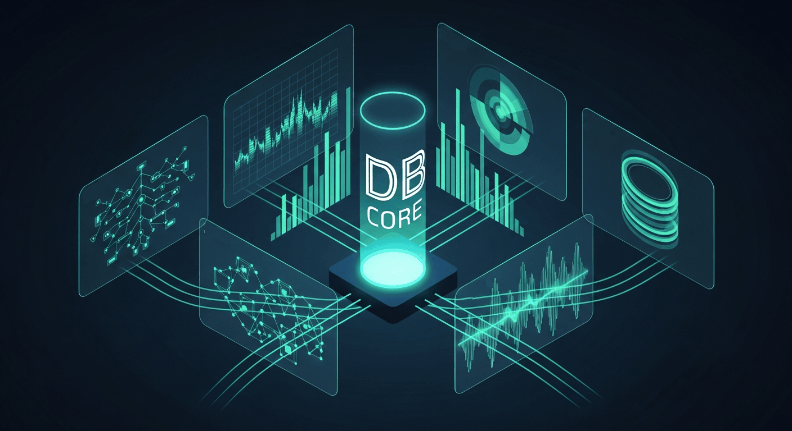

# NFT Marketplace Database Schema — Case Study (Docs-only)

## Overview
A database-centric architecture and schema strategy for an NFT marketplace designed for high write throughput, consistent ledger projections, and reliable reconciliation with on-chain events.

## What I Built
- Relational schema design for trades, orders, assets, users, and event receipts
- Deterministic reconciliation model bridging chain events and off-chain state
- Indexing strategy for high-frequency query patterns
- Data integrity controls to eliminate race conditions and partial writes

## Key Outcomes
- Stable projections from on-chain events into off-chain query models
- Improved query latency via targeted indexes and denormalised read views
- Reduced consistency bugs through idempotent ingestion and replay-safe writes

## Architecture Highlights
- **Primary store:** PostgreSQL (normalised core + read optimised views)
- **Ingestion:** event receipts + idempotency keys
- **Integrity:** constraints, transactional writes, and dedupe strategy
- **Performance:** partitioning-ready tables + hot index optimisation

## Docs
- [00 — Index](./docs/00-index.md)
- [01 — Domain Model and Entities](./docs/01-domain-model-and-entities.md)
- [02 — Schema Design and Constraints](./docs/02-schema-design-and-constraints.md)
- [03 — Indexing and Query Patterns](./docs/03-indexing-and-query-patterns.md)
- [04 — Event Ingestion and Reconciliation](./docs/04-event-ingestion-and-reconciliation.md)
- [05 — Performance, Scaling, and Backups](./docs/05-performance-scaling-and-backups.md)

## Notes
This repository is documentation-only and contains no proprietary source code.
